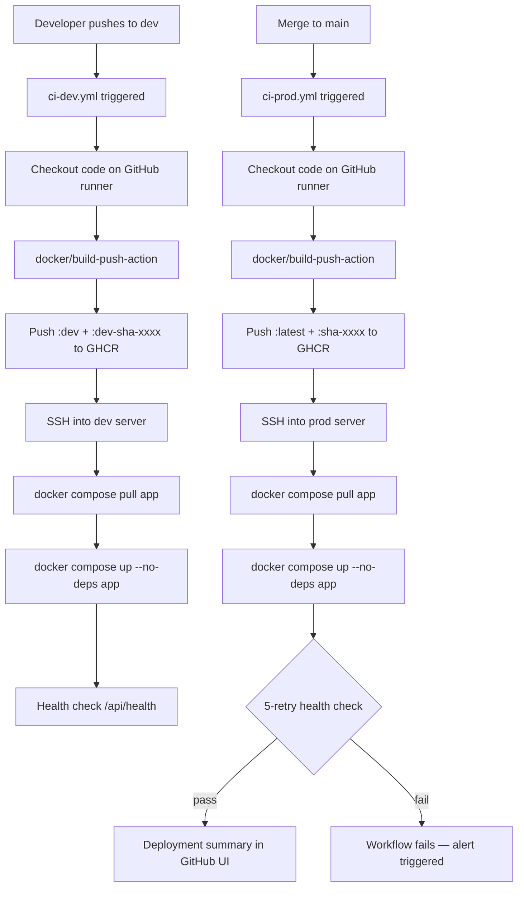

# CI/CD Technical Documentation

## Overview

The CI/CD pipeline uses **GitHub Actions** with **GitHub Container Registry (GHCR)** to automate building, pushing, and deploying Docker images. Two workflows map directly to two Git branches and two environments:

| Branch | Workflow | Registry Tag | Environment |
|---|---|---|---|
| `dev` | `ci-dev.yml` | `:dev` + `:dev-sha-XXXXXXX` | Development server |
| `main` | `ci-prod.yml` | `:latest` + `:sha-XXXXXXX` | Production server |

---

## Pipeline Architecture



---

## Workflow Files

| File | Trigger | Description |
|---|---|---|
| [`.github/workflows/ci-dev.yml`](../.github/workflows/ci-dev.yml) | `push` to `dev` branch | Build + push dev image + deploy dev |
| [`.github/workflows/ci-prod.yml`](../.github/workflows/ci-prod.yml) | `push` to `main` + manual dispatch | Build + push prod image + deploy prod |
| [`.github/workflows/deploy.yml`](../.github/workflows/deploy.yml) | `push` to `main` (legacy) | Old self-hosted runner workflow (preserved) |

---

## ci-dev.yml — Detailed Steps

**Trigger:** `push` to `dev` branch

### Job 1: `build-and-push`
| Step | Action | Detail |
|---|---|---|
| Checkout | `actions/checkout@v4` | Clone repo on GitHub's Ubuntu runner |
| Buildx setup | `docker/setup-buildx-action@v3` | Enable multi-platform builds |
| GHCR Login | `docker/login-action@v3` | Uses `GITHUB_TOKEN` (automatic — no secret needed) |
| Metadata | `docker/metadata-action@v5` | Generates tags: `:dev`, `:dev-sha-XXXXXXX` |
| Build & Push | `docker/build-push-action@v5` | Builds `deployment/Dockerfile`, pushes with layer cache (`cache-from/to: type=gha`) |

Image layer caching via `cache-from: type=gha` significantly speeds up repeat builds — only changed layers are rebuilt.

### Job 2: `deploy-dev`
| Step | Action | Detail |
|---|---|---|
| SSH Deploy | `appleboy/ssh-action@v1` | SSHs into dev server using `DEV_SSH_*` secrets |
| Pull Image | `docker login; docker compose pull app` | Pulls `:dev` tag |
| Restart App | `docker compose up -d --no-deps app` | Zero-downtime: only app container restarts, DB stays up |
| Health Check | `curl /api/health` | Confirms successful boot |

---

## ci-prod.yml — Detailed Steps

**Trigger:** `push` to `main` **and** `workflow_dispatch` (manual trigger from GitHub UI)

### Job 1: `build-and-push`

Same as dev job except tags are `:latest` and `:sha-XXXXXXX` (full traceability).

### Job 2: `deploy-prod`
| Step | Action | Detail |
|---|---|---|
| SSH Deploy | `appleboy/ssh-action@v1` | SSHs into prod server using `PROD_SSH_*` secrets |
| Pull Image | `docker compose pull app` | Pulls `:latest` |
| Restart App | `docker compose up -d --no-deps app` | Zero-downtime rolling restart |
| 5-Retry Health | Loop: `curl /api/health` | Retries every 10s for up to 50s. Fails CI run if unhealthy |

### Job 3: `notify-success`
Generates a GitHub **deployment summary** in the Actions UI with:
- Commit SHA
- Image tags
- Deployed-by actor
- Link to production URL

---

## Required GitHub Secrets

Configure at: **GitHub repo → Settings → Secrets and variables → Actions**

| Secret Name | How to Get It | Used By |
|---|---|---|
| `DEV_SSH_HOST` | Dev server IP / hostname | `ci-dev.yml` |
| `DEV_SSH_USER` | SSH username on dev server (e.g. `ubuntu`) | `ci-dev.yml` |
| `DEV_SSH_KEY` | Private SSH key: `cat ~/.ssh/id_rsa` | `ci-dev.yml` |
| `PROD_SSH_HOST` | Prod server IP / hostname | `ci-prod.yml` |
| `PROD_SSH_USER` | SSH username on prod server | `ci-prod.yml` |
| `PROD_SSH_KEY` | Private SSH key for prod server | `ci-prod.yml` |

> [!NOTE]
> `GITHUB_TOKEN` is automatically injected by GitHub Actions — you do not need to create it. It's used for GHCR authentication and always has read/write access to the repo's packages.

---

## GitHub Environments

Set up at: **GitHub repo → Settings → Environments**

| Environment | Used By | Recommended Settings |
|---|---|---|
| `development` | `ci-dev.yml` deploy job | None required |
| `production` | `ci-prod.yml` deploy job | Add required reviewer(s) for manual approval before prod deploy |

---

## Image Registry (GHCR)

Images are hosted at:
```
ghcr.io/me-abhishekpal/client-happiness-dashboard
```

Browse all tags: `https://github.com/me-abhishekpal/client-happiness-dashboard/pkgs/container/client-happiness-dashboard`

### Image Visibility

After the first CI run, set the package visibility:
1. Go to GitHub → your profile → **Packages**
2. Find `client-happiness-dashboard`
3. **Package Settings → Change visibility → Public** (or link to the repository for private access)

---

## Layer Caching

Both workflows use **GitHub Actions Cache** (`cache-from: type=gha`) for Docker layer caching. This means:

- **First build**: All layers built from scratch (~5-8 min)
- **Subsequent builds**: Only changed layers rebuilt (~1-3 min for code changes)
- **Cache scope**: Separate cache per branch (`dev` cache doesn't pollute `main` cache)

---

## Manual Emergency Deploy

If you need to deploy without a git push:

1. Go to **GitHub → Actions → CI — Production Deployment**
2. Click **"Run workflow"** → select `main` branch → click green **Run workflow**
3. This triggers the full build + deploy pipeline

---

## Rollback Procedure

```bash
# 1. Find the SHA tag of the last good deploy
# From GitHub Actions summary, or from GHCR package page

# 2. SSH into production server
ssh user@prod-server

# 3. Run rollback
cd ~/client-happiness
./deployment/rollback.sh sha-abc1234def5678

# The script pulls the specific SHA-tagged image
# and restarts only the app service (DB untouched)
```

---

## Branch Strategy

```
main    ──────── production-ready, protected, requires PR
  │
  └─── dev ──── active development, auto-deploys to dev server
         │
         └─── feature/* ── individual features (PR → dev)
```

**Recommended workflow:**
1. Create feature branches from `dev`
2. Open PR → merge into `dev` (CI builds dev image)
3. Test on dev server
4. When ready: merge `dev` → `main` (CI builds prod image + deploys)

---

## Estimated Build Times

| Scenario | Estimated Duration |
|---|---|
| First build (no cache) | 6–10 minutes |
| Code change only (cached deps) | 2–4 minutes |
| Deps change (package.json) | 4–7 minutes |
| SSH deploy step | ~30 seconds |
| Health check (5 retries max) | 20–70 seconds |
| **Total typical pipeline** | **3–6 minutes** |

---

## Troubleshooting

**CI fails at GHCR push:**
- Ensure the workflow has `permissions: packages: write` in the job definition (already set)
- Check that the GHCR package is linked to the repo or visibility is set correctly

**SSH deploy fails:**
- Verify `DEV_SSH_KEY` / `PROD_SSH_KEY` secrets contain the full private key including `-----BEGIN...` and `-----END...` lines
- Confirm the server's `~/.ssh/authorized_keys` has the corresponding public key
- Check server has Docker + Docker Compose installed

**Health check fails:**
- SSH into server: `docker logs client-happiness-app` to check for startup errors
- Common cause: missing env var in `.env` file on server
- Run `docker exec client-happiness-app cat /etc/os-release` to confirm container is alive

**Image not found:**
- Ensure the package visibility on GHCR allows the server to pull
- Or: `docker login ghcr.io -u GITHUB_USER -p GITHUB_TOKEN` on the server
