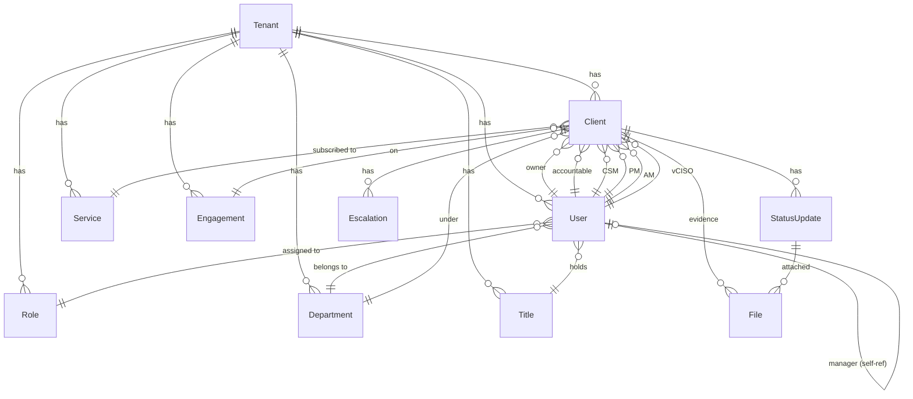

# Database Technical Documentation

## Overview

The database layer uses **PostgreSQL 17** as the backend and **Prisma 7** as the ORM. The schema is designed around a **multi-tenant architecture** where every record is scoped to a `tenantId`, providing complete data isolation between organizations on the platform.

---

## Technology Stack

| Technology | Version | Purpose |
|---|---|---|
| PostgreSQL | 17 (Alpine) | Primary relational database |
| Prisma ORM | 7.4.x | Schema management, migrations, client |
| `@prisma/adapter-pg` | 7.x | pg-native driver adapter |
| `pg` (node-postgres) | 8.x | PostgreSQL Node.js driver |
| bcryptjs | 2.x | Password hashing in seed scripts |

---

## Directory Structure

```
database/
├── prisma/
│   ├── schema.prisma        # Prisma data model (source of truth)
│   ├── seed.js              # Seeding script (Node.js / CommonJS)
│   ├── seed.ts              # TypeScript seed variant
│   ├── migrations/          # Auto-generated SQL migrations
│   │   └── 20260218.../     # Timestamped migration folders
│   └── dev.db               # SQLite dev fallback (legacy — not used in prod)
│
├── prisma.config.ts         # Prisma v7 config (schema path, migrations, seed)
├── scripts/                 # Ad-hoc database utilities
│   ├── import-csv.ts        # Bulk client import from CSV
│   └── check-users.ts       # Verify user state in DB
├── data.csv                 # Sample client data for import
└── uploads/                 # Uploaded evidence files (mounted as Docker volume)
```

---

## Schema Overview

The schema lives at `database/prisma/schema.prisma` and defines **12 models**:

```
Tenant          — root isolation unit for all data
SuperAdmin      — platform-level admin (cross-tenant)
User            — tenant-scoped user with auth, RBAC, and org hierarchy
Role            — tenant-scoped role with JSON permissions
Title           — hierarchical job titles (CEO → CTO → VP → ...)
Department      — organizational departments (MIS, MSS, MEA, PMO, ...)
Client          — the core entity: a customer account being tracked
Service         — service categories (MSS, ITO, MIS, MEA, vCISO)
Engagement      — specific engagement types (SOC 2 Readiness, etc.)
StatusUpdate    — audit log of client health status changes
File            — uploaded evidence files attached to status updates
Escalation      — high-priority issues flagged against a client
```

---

## Entity-Relationship Diagram



---

## Model Reference

### Tenant
Central isolation unit. Every other model has a `tenantId` foreign key.

| Field | Type | Notes |
|---|---|---|
| `id` | CUID | Primary key |
| `slug` | String (unique) | URL-safe identifier e.g. `acme-corp` |
| `subdomain` | String? | e.g. `acme` → `acme-rag.abhee.org` |
| `customDomain` | String? | e.g. `happiness.acme.com` |
| `allowedEmailDomain` | String? | Restricts login to `@domain.com` |
| `branding` | String? | JSON: `{logo, primaryColor, companyName}` |
| `plan` | String | `free` / `pro` / `enterprise` |
| `status` | String | `active` / `suspended` / `cancelled` |

### User
Tenant-scoped user supporting auth, RBAC, org hierarchy, and client assignments.

| Field | Type | Notes |
|---|---|---|
| `email + tenantId` | Unique composite | Same email can exist across tenants |
| `role` | String | Legacy string: `ADMIN`, `EXECUTIVE`, `MANAGER`, `VIEWER` |
| `roleId` | FK → Role | New RBAC relation (preferred) |
| `titleId` | FK → Title | Org hierarchy title |
| `managerId` | FK → User | Self-referencing for org tree |
| `departmentId` | FK → Department | Organizational unit |
| `passwordHash` | String? | bcrypt hash |
| `inviteToken` | String? (unique) | Magic link for first-login |
| `mfaSecret` | String? | TOTP secret (Speakeasy) |
| `mfaEnabled` | Boolean | MFA enforcement flag |
| `isGuest` | Boolean | View-only guest outside allowed email domain |
| `deletedAt` | DateTime? | Soft delete field |

### Client
The core tracked entity — an external customer account.

| Field | Type | Notes |
|---|---|---|
| `status` | String | `RED` / `AMBER` / `GREEN` / `UNKNOWN` |
| `revenue` | Float? | Annual revenue figure |
| `nps` | Int? | Net Promoter Score (-100 to 100) |
| `kudos` | Int? | Positive feedback count |
| `ownerId` | FK → User | Primary account owner |
| `accountableId` | FK → User | Accountability person (vertical head) |
| `csmId` | FK → User | Customer Success Manager |
| `pmId` | FK → User | Project Manager |
| `amId` | FK → User | Account Manager |
| `vcisoId` | FK → User | Virtual CISO |
| `isOnWatchlist` | Boolean | Flagged for extra attention |
| `deletedAt` | DateTime? | Soft delete |

### Role
Tenant-scoped RBAC role with a JSON permissions array.

```json
// permissions field examples:
["*"]                                              // ADMIN — full access
["dashboard", "clients_read", "reports"]           // EXECUTIVE
["dashboard", "clients_read", "clients_write"]     // MANAGER
["dashboard"]                                      // VIEWER
```

---

## Multi-Tenant Data Isolation

All queries **must** include `tenantId`. The `getTenantPrisma()` helper in `lib/prisma-tenant.ts` wraps the Prisma client and ensures the tenant context is automatically applied.

```typescript
// lib/prisma-tenant.ts
const prisma = await getTenantPrisma();
const clients = await prisma.client.findMany({
  where: { tenantId }   // Always scoped — never cross-tenant leakage
});
```

> [!CAUTION]
> **Never** use the base `prismaBase` client for tenant-data queries. Always use tenant-scoped helpers.

---

## Migrations

Prisma v7 uses `prisma.config.ts` as the central configuration file.

```bash
# Run from repo root
cd database

# Create and apply a new migration
npx prisma migrate dev --config prisma.config.ts --name <description>

# Apply pending migrations in production (no schema changes, no prompt)
npx prisma migrate deploy

# Check migration status
npx prisma migrate status --config prisma.config.ts

# Reset database (dev only — drops all data!)
npx prisma migrate reset --config prisma.config.ts
```

Migration files live in `database/prisma/migrations/` — each is a timestamped folder containing `migration.sql`.

---

## Seed Data

The seed script (`database/prisma/seed.js`) creates a complete multi-tenant dataset:

| Entity | Count | Notes |
|---|---|---|
| SuperAdmin | 1 | `abhee@example.com` |
| Tenant | 1 | `default` slug, `example.com` email domain |
| Roles | 4 | ADMIN, EXECUTIVE, MANAGER, VIEWER |
| Departments | 5 | MIS, MSS, MEA, ITO, PMO |
| Titles | 14 | CEO → CTO/VP → Director → Manager → ICs |
| Users | 58 | 1 admin + 57 org-chart users |
| Services | 5 | MSS, ITO, MEA, MIS, vCISO |
| Engagements | 5 | Annual Subscription, SOC 2 Readiness, etc. |
| Clients | 200 | Random statuses, revenues, team assignments |

```bash
# Run seed manually
cd database
npx prisma db seed

# Or via config
npx prisma db seed --config prisma.config.ts
```

Seed uses **upserts** — safe to re-run without duplicating data.

---

## Prisma Client Generation

The Prisma client is generated to `frontend/node_modules/.prisma/client` so it can be imported directly by the Next.js app.

```bash
# Regenerate client (after schema changes)
cd database
npx prisma generate --config prisma.config.ts
```

Binary targets in `schema.prisma` support both local development (mac/arm64) and Docker (linux-musl):

```prisma
binaryTargets = ["native", "linux-musl-arm64-openssl-3.0.x", "linux-musl-openssl-3.0.x"]
```

---

## Connection Pooling

The app uses `@prisma/adapter-pg` with a `pg.Pool` for connection pooling:

```typescript
// lib/prisma-base.ts
const pool = new Pool({ connectionString: process.env.DATABASE_URL });
const adapter = new PrismaPg(pool);
const prisma = new PrismaClient({ adapter });
```

This is optimal for Next.js serverless/edge environments where connections are shared across requests.

---

## File Uploads

Uploaded evidence files are stored in `database/uploads/` which is mounted as a Docker named volume (`uploads_data`) ensuring persistence across container restarts.

```yaml
# docker-compose.yml
volumes:
  - uploads_data:/app/database/uploads
```
